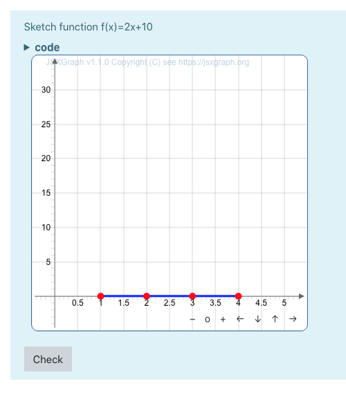
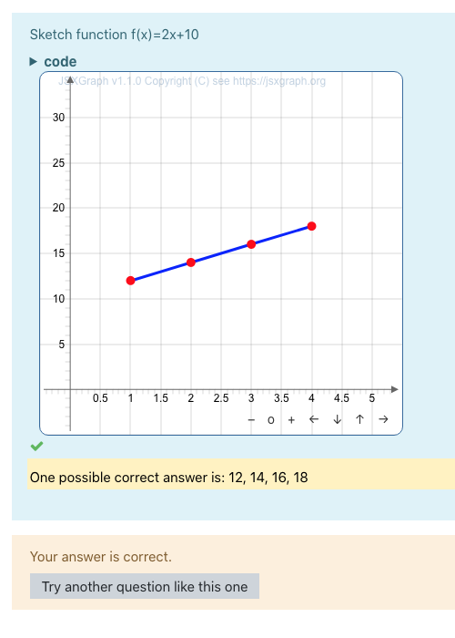
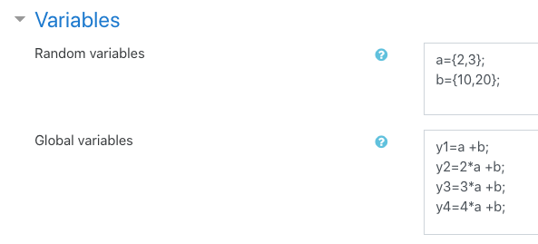

# moodleformulas_jsxgraph

The moodle plug-in [moodle question type formulas](https://moodle.org/plugins/qtype_formulas), see also <https://moodleformulas.org/>, allows to create question containing random values and multiple answer fields.
The file `jsxquestion.js` supplies the transfer of values between the formulas question and [JSXGraph](https://jsxgraph.org) constructions. 

## Installation

Download the file `src/jsxquestion.js` to the moodle installation or a public server.


## Example

Consider the following *formulas* question:



The students should drag the red points such that the blue curve has the equation *y = 2x + 10*.
After having done so, the student clicks on the Check-button to check the correctness of the solution. The correct solution is



The above question can be realized with *formulas* (without JSXGraph) by supplying the following data:



The variable *a* takes a random value out of the set *{2, 3}* and the variable *b* takes a random value out of the set *{10, 20}*. Since the student has to compute *ax+b* for the values *1, 2, 3, 4*, the correct values are precomputed in the global variables *y1, y2, y3, y4*. As correct answer we demand from the student the four values: *[y1, y2, y3, y4]*. 


Without JSXGraph the student would have to type the four numbers of the solution into four input fields.
Now this question is enriched with a JSXgraph construction. This can be done by adding the following code into the field "Part's text" in Part 1.

```html
<!-- Load the necessary JavaScript files -->
<script type="text/javascript" src="https://jsxgraph.org/distrib/jsxgraphcore.js"></script>
<script type="text/javascript" src="https://code.jquery.com/jquery-3.1.0.min.js"></script>
<script type="text/javascript" src="https://somedomain.../jsxquestion.js"></script>

<!-- Create a div containing the JSXGraphconstruction -->
<div id="box1" class="jxgbox" style="width:400px; height:400px; margin-left:10px;"></div>

<script type="text/javascript">
$(function() {

  // JavaScript code to create the construction.
  var jsxCode = function (formulas) {
  
    // -------  IMPORT FROM FORMULAS -------
    // Import the initial y-coordinates of the four points from formulas
    var t1 = formulas.get(0); if (t1 === null) { t1 = 0; }
    var t2 = formulas.get(1); if (t2 === null) { t2 = 0; }
    var t3 = formulas.get(2); if (t3 === null) { t3 = 0; }
    var t4 = formulas.get(3); if (t4 === null) { t4 = 0; }

    // -------  JSXGraph -------------------
    // Initialize the construction
    formulas.board = JXG.JSXGraph.initBoard(formulas.elm.id, {
                axis:true,
                boundingbox: [-.5, 35, 5.5, -5],
                showCopyright: true,
                showNavigation: true
            });
    
    var board = formulas.board;
    // Four invisible, vertical lines
    var line1 = board.create('segment', [[1,-10], [1,100]], {visible:false});
    var line2 = board.create('segment', [[2,-10], [2,100]], {visible:false});
    var line3 = board.create('segment', [[3,-10], [3,100]], {visible:false});
    var line4 = board.create('segment', [[4,-10], [4,100]], {visible:false});

    // The four points fixated to the lines, called 'gliders'.
    var point_attr = {fixed: formulas.isSolved, snapToGrid: true, withLabel: false}
    var p = [];
    p.push(board.create('glider', [1, t1, line1], point_attr));
    p.push(board.create('glider', [2, t2, line2], point_attr));
    p.push(board.create('glider', [3, t3, line3], point_attr));
    p.push(board.create('glider', [4, t4, line4], point_attr));

    // The polygonal chain, aka. polyline, through the four points
    board.create('polygonalchain', p, {borders: {strokeWidth: 3}});

    // -------  EXPORT TO FORMULAS ---------
    // Function to export the y-coordinates of the points to formulas.
    var setValues = function () {
      formulas.set(0, p[0].Y());
      formulas.set(1, p[1].Y());
      formulas.set(2, p[2].Y());
      formulas.set(3, p[3].Y());
    };
  
    // Whenever the construction is altered the values of the points are sent to formulas.
    board.on('update', function () {
        setValues();
    });
    board.update();
  };

  // Execute the JavaScript code.
  new JSXQuestion("box1", jsxCode, false);
  
});
</script>
```

